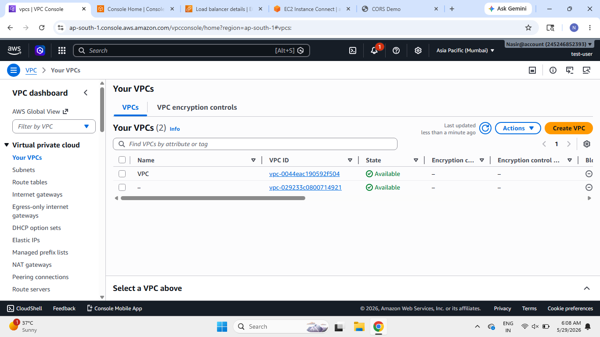
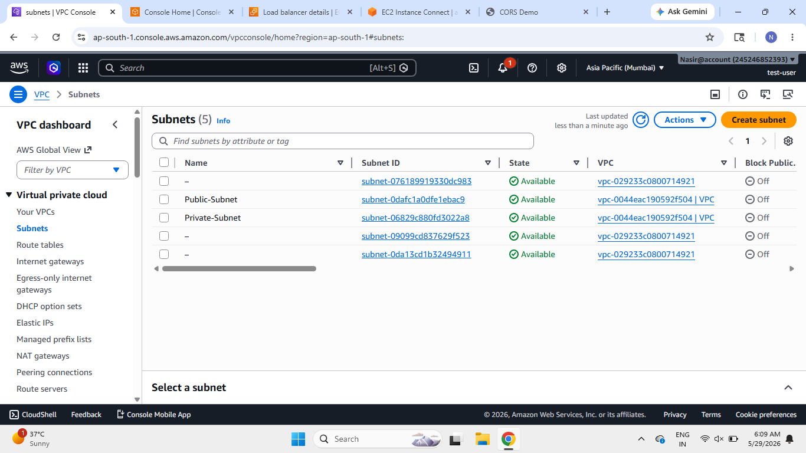
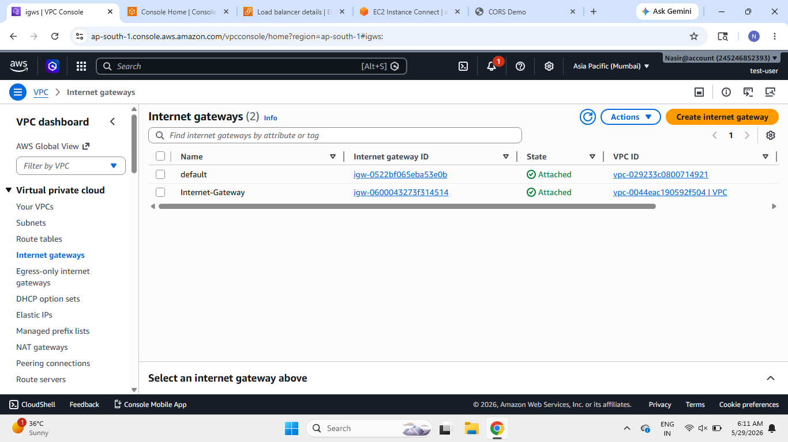
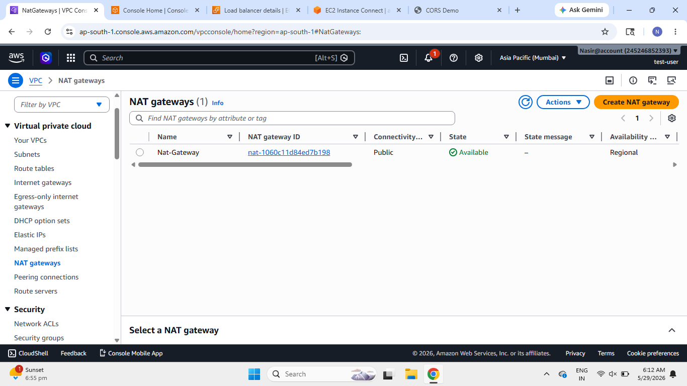
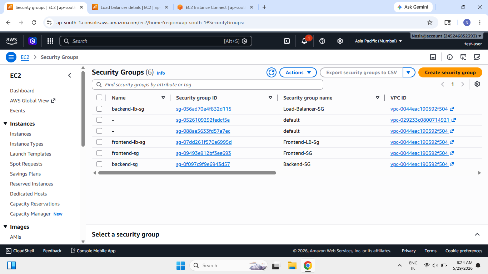
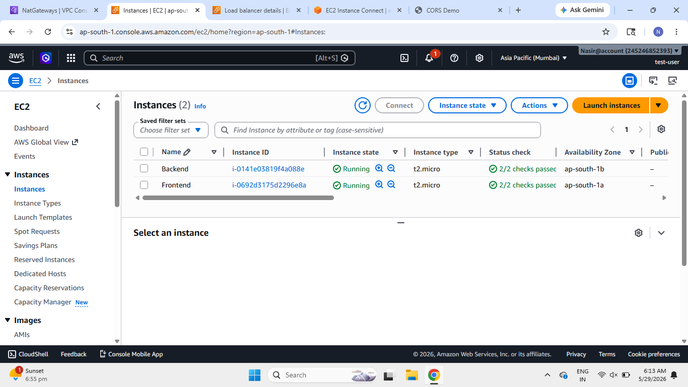
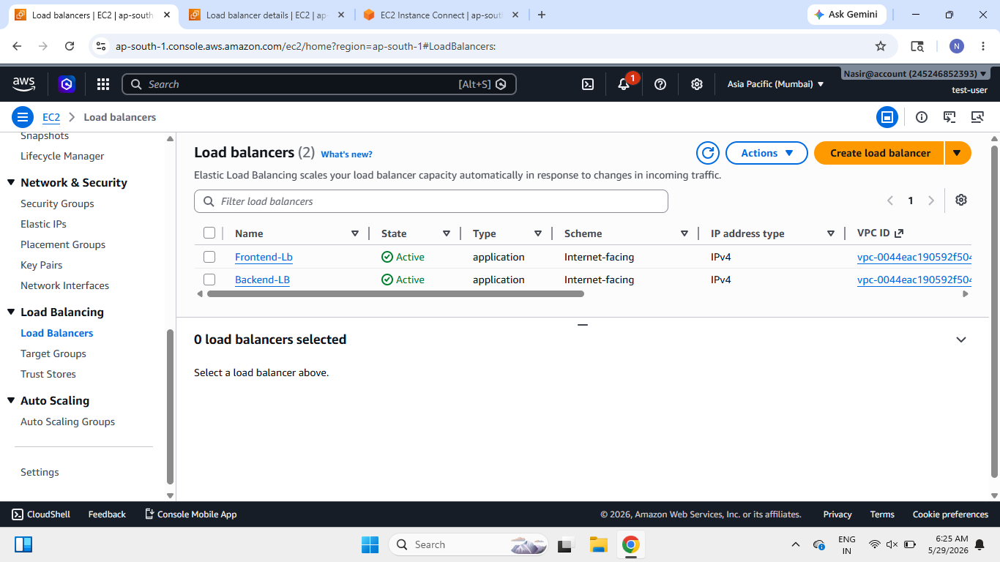
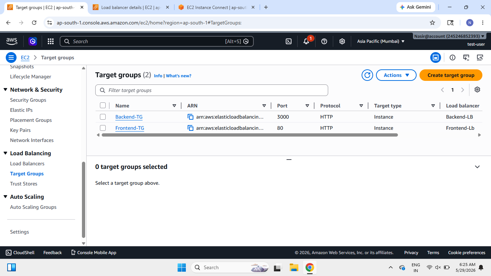
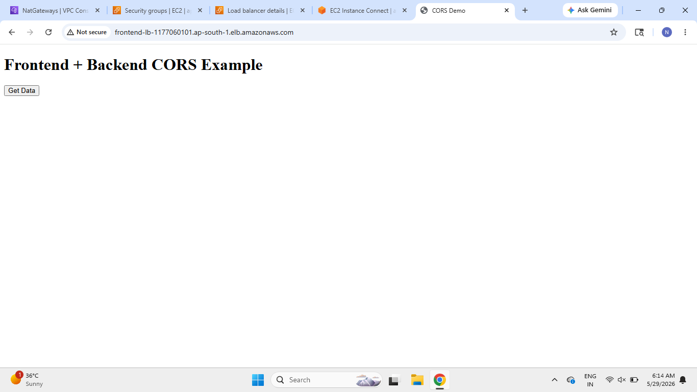
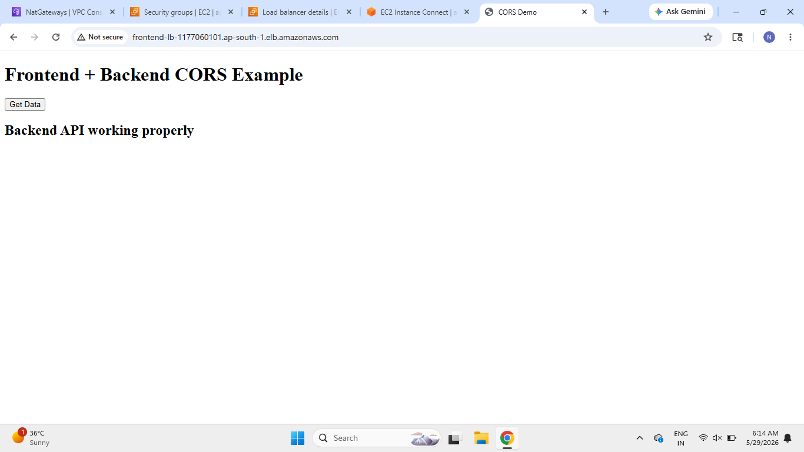

# ----------------------------------------------
# Secure Public + Private AWS Architecture
# ----------------------------------------------

## Project Overview

This project demonstrates a real-world secure AWS networking architecture using a custom VPC with public and private subnets.

The architecture was designed to simulate how frontend and backend servers communicate securely inside AWS while following proper networking and security practices.

The project includes:

- Custom VPC
- Public and Private Subnets
- Internet Gateway
- NAT Gateway
- Route Tables
- Security Groups
- EC2 Instances
- Load Balancers
- Target Groups
- Internal Communication
- CloudWatch Monitoring
- Secure Public + Private Architecture

---

# ----------------------------------------------
# Architecture Goal
# ----------------------------------------------

This architecture was designed with the following objectives:

✅ Public frontend accessible from internet

✅ Backend server protected inside private network

✅ Internal communication between frontend and backend

✅ Least privilege security group configuration

✅ Proper public/private subnet routing

✅ Secure network isolation

✅ Real-world AWS networking understanding

---

# ----------------------------------------------
# Architecture Components
# ----------------------------------------------

## VPC

- Custom AWS VPC created
- Separate isolated network environment
- Used for secure communication between AWS resources

---

## Public Subnet

Used for:

- Frontend EC2 Instance
- Public Load Balancer

Features:

- Internet access enabled
- Route to Internet Gateway

---

## Private Subnet

Used for:

- Backend EC2 Instance

Features:

- No direct internet access
- Protected internal communication only

---

## Internet Gateway

Used to provide internet access for public resources inside the VPC.

Attached to:

- Public Route Table

---

## NAT Gateway

Used for outbound internet access from private subnet resources without exposing them publicly.

---

## Route Tables

Configured separate route tables for:

### Public Route Table

Routes:

- Local VPC communication
- Internet access through Internet Gateway

### Private Route Table

Routes:

- Local VPC communication
- Outbound internet through NAT Gateway

---

## Security Groups

Implemented separate security groups using least privilege access.

### Frontend Security Group

Allowed:

- HTTP (80)
- SSH (22)

### Backend Security Group

Allowed:

- Internal traffic only from frontend server
- No public internet access

---

## EC2 Instances

### Frontend EC2

Purpose:

- Public web server

Features:

- Publicly accessible
- Connected with Load Balancer
- Hosts frontend application

---

### Backend EC2

Purpose:

- Internal backend API server

Features:

- No public IP
- Accessible only internally
- Protected inside private subnet

---

## Load Balancers

### Frontend Load Balancer

Used to expose frontend application publicly.

### Backend Load Balancer

Used for secure backend communication handling.

---

## Target Groups

Configured target groups for:

- Frontend server
- Backend server

Used for proper traffic forwarding from load balancers to EC2 instances.

---

## CloudWatch Monitoring

Used AWS EC2 basic monitoring for:

- CPU Utilization
- Network Traffic
- Status Checks

---

# ----------------------------------------------
# Security Implementation
# ----------------------------------------------

Implemented security best practices:

- Private backend server
- Separate security groups
- Restricted inbound rules
- Least privilege access
- Internal-only backend communication
- No unnecessary open ports

---

# ----------------------------------------------
# Project Workflow
# ----------------------------------------------

1. User accesses frontend application

2. Frontend Load Balancer forwards request to frontend EC2

3. Frontend communicates internally with backend server

4. Backend processes request securely inside private subnet

5. Response returned to frontend

---

# ----------------------------------------------
# Validation Tests
# ----------------------------------------------

## Successful Tests

✅ Frontend accessible from browser

✅ Frontend server reachable through SSH

✅ Backend server not publicly accessible

✅ Internal communication working

✅ Security groups functioning properly

✅ Routing configured correctly

✅ Load balancers forwarding traffic successfully

✅ CloudWatch metrics visible

---

# ----------------------------------------------
# Troubleshooting Performed
# ----------------------------------------------

During this project multiple issues were intentionally tested and fixed:

- Wrong security group rules
- Route table misconfiguration
- Incorrect subnet placement
- Missing Internet Gateway routes
- Backend communication failures

This helped in understanding:

- AWS network flow
- Public vs private routing
- Security group behavior
- Internal VPC communication
- Troubleshooting methodology

---

# ----------------------------------------------
# Technologies Used
# ----------------------------------------------

- AWS VPC
- AWS EC2
- AWS Load Balancer
- AWS Target Groups
- AWS Internet Gateway
- AWS NAT Gateway
- AWS Security Groups
- AWS CloudWatch
- HTML
- Node.js

---

# ----------------------------------------------
# What I Learned
# ----------------------------------------------

This project helped me understand:

- Real-world AWS networking
- Public vs private architecture
- Internal server communication
- Security group implementation
- Route table logic
- Load balancer workflow
- Secure backend isolation
- NAT Gateway usage
- Cloud architecture troubleshooting
- AWS infrastructure design concepts

---

# ----------------------------------------------
# Author
# ----------------------------------------------

Nasiroddin Khatib

GitHub:
https://github.com/nasiroddin-khatib

